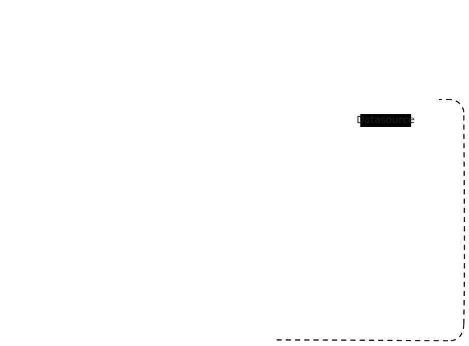

# Loki Demo

Repository for deploying a simple Loki installation along with an application to generate logs

## Description

This project is just a simple simulation of a Loki installations to test basic functionality. It is based on 'what-is-loki' branch of [loki-fundamentals](https://github.com/grafana/loki-fundamentals) official repository.

## High-level diagram


## Considerations
`main` branch does not include a Grafana instance, since the original idea was to use an existing Grafana container. Therefore all the components use the "grafana-network".

## Installation
1. Clone the repository
```bash
git clone https://github.com/afernandezrios90/loki-demo.git
```
2. Adjust the configuration if desired to change log path, processing features, etc, if desired
3. Run using Docker compose
```bash
docker-compose up -d
```
4. Open the "Carnivorous Garden" app in your browser (`http://localhost:5005`) and interact to start generating interesting log content.
5. Add Loki installation as datasource in Grafana and start reviewing logs.

## Troubleshooing
### Test logs ingestion
Check the Loki logs (`docker logs -f loki`) and search some lines like this one:

`level=info ts=2025-02-26T18:45:30.123456Z caller=ingester.go:150 msg="received new log entry"`